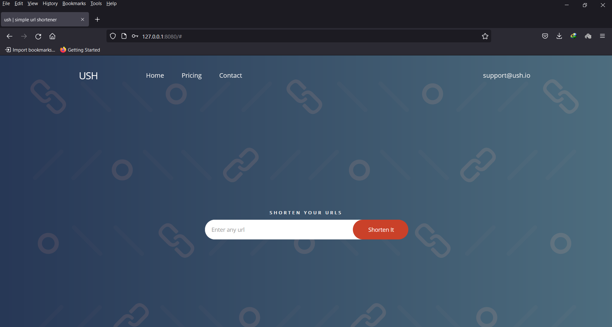
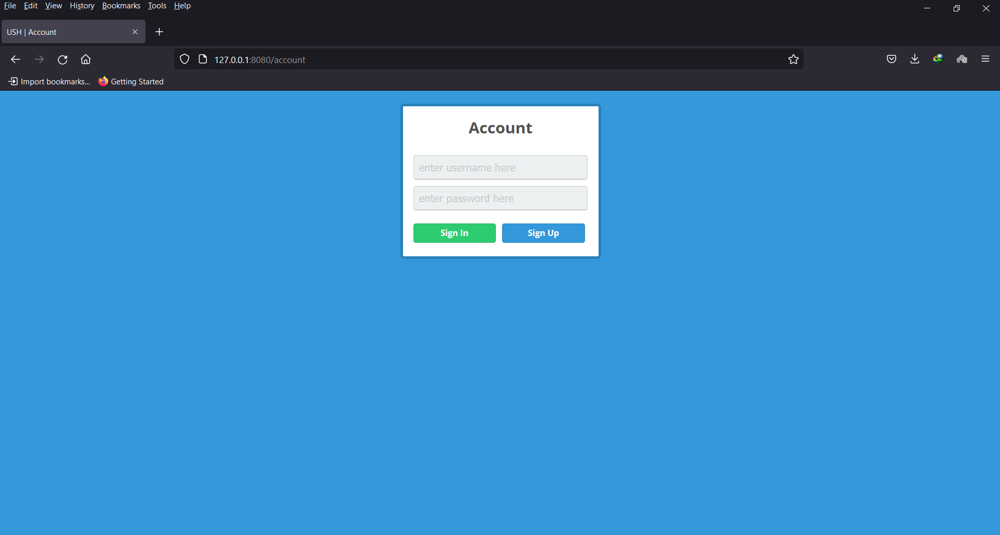

# USH
a simple url shortener in node js

&nbsp;
<div><center></center><br><center></center></div>

&nbsp;
### Description
*USH* is a simple url shortener in node js and based on mongodb. in this app clients must singup and have account, after that they can shorten URLs easily.

&nbsp;
### How to install
first make sure you installed node and mongodb on your system. after that:
```bash
git clone https://github.com/0xDeviI/ush
cd ush
npm install
```

&nbsp;
### How to run
you can easily run app with node command or using nodemon:
```bash
node app.js
```
or
```bash
nodemon app.js
```
